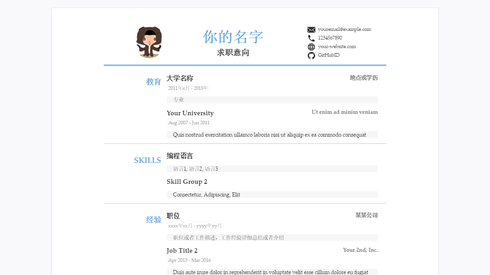
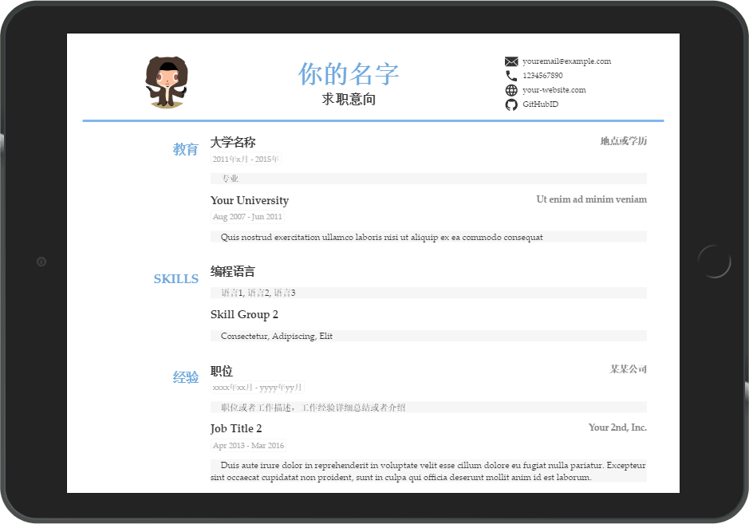
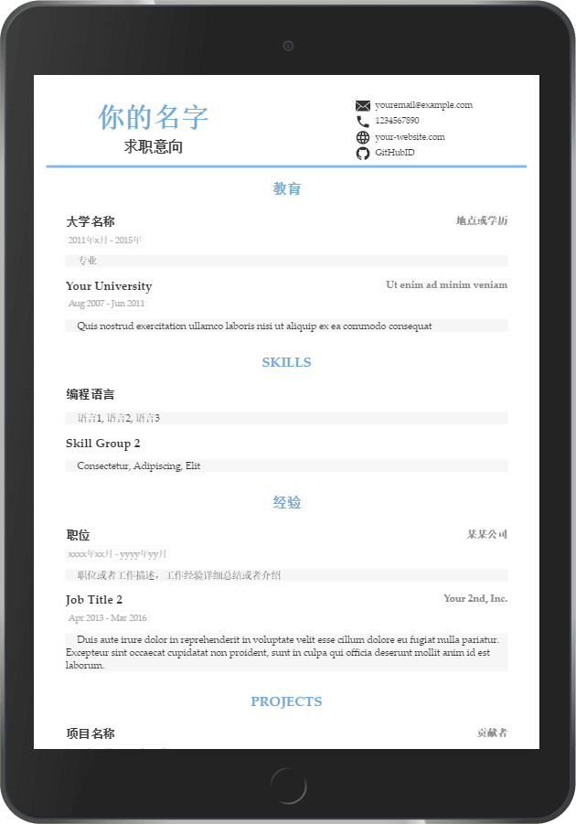
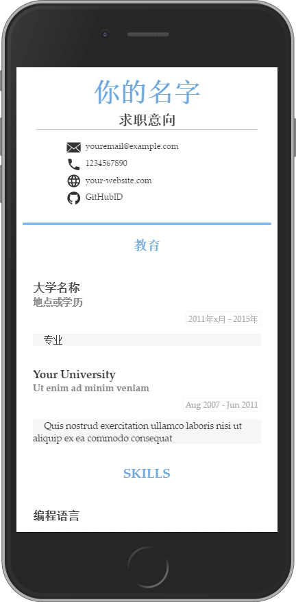
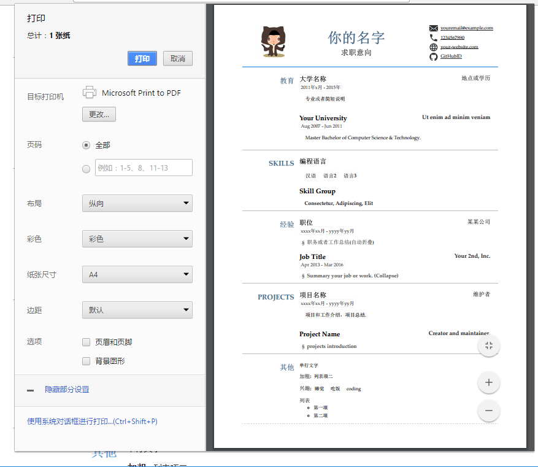

# CV(简历)自动生成
简历模板自动生成gh-pages. A resume template auto builds in github-pages by Jekyll

数据格式：
* [x] `markdown`方便书写([预览](https://newfuture.github.io/CV/markdown))
* [x] `yaml`(方便人读写，支持复杂嵌套)
* [x] `json`(方便程序转换)

* [x] 手机端适配
* [x] 打印格式优化(可导PDF)
* [x] html和css压缩
* [x] [HTML5语义化支持](https://validator.w3.org/nu/?doc=https%3A%2F%2Fnewfuture.github.io%2FCV%2F&showoutline=yes)
* [x] 简单markdown嵌套

浏览器兼容:

* [x] Chrome
* [x] Andoroid (系统内置浏览器,微信等)
* [x] Edge (Windows 10)
* [x] >=IE7 (支持IE: 7 8 9 10 11)(Windows vista,7及以上系统)
* [x] IE6 显示基本一致可读(Windows XP默认版本，显示略有差别)
* [x] Safari (包括Mac, iPhone和iPad)
* [x] FireFox

更多示例: [examples](https://github.com/NewFuture/CV/issues/1)

## 在线使用

1. 应用此模板: 登录github, 点击[`Use this template`按钮](https://github.com/NewFuture/CV/generate)使用此模板
2. 设置`Repository name`仓库名如`CV`(仓库名与最后网站一致,可自行选择私有公开),然后在自己的仓库下进行此操作
3. 修改: 打开[\_data/resume.yml](\_data/resume.yml)(或者resume.json)点击编辑(`Edit`)图标(内容和条目根据需要参考注释删减)
4. 保存: 点击`Commit changes` (会自动commit)注意yaml格式(或者json格式)无误
5. 稍等片刻(自动编译生成github pages),打开[{your-github-id}.github.io/CV/](https://newfuture.github.io/CV/) (命名与项目名一致)查看效果

## contribution

> 如果你想改进此模板
1. 可[`fork`](https://github.com/NewFuture/CV/fork)此模板
2. 在fork后的仓库修改和预览
3. 提交[`pull requests`](https://github.com/NewFuture/CV/pulls)

## 效果截图(点击展开)

不同系统和不同浏览器截图可[在此处查看](https://developer.microsoft.com/en-us/microsoft-edge/tools/screenshots/?url=https%3A%2F%2Fnewfuture.github.io%2FCV%2F)

 1. 标准PC版(宽度> 1024)

 
2. iPad Pro或窄屏笔记本( 1024 >= width >= 768)

3. iPad mini或宽屏Note( 768 >= width > 450)

4. 标准手机版( width <= 450)

5. 打印版 (可配置样式和导出PDF)

## 高级用法

### 导出 PDF
1. 浏览器(推荐chrome)点击页面底部`打印`
2. 选择打印为PDF文档
3. 配置打印设置(布局样式,字体大小,边距等) [_config.yml](https://github.com/NewFuture/CV/blob/gh-pages/_config.yml#L6)

### 本地调试
1. 安装[jekyll](http://jekyllcn.com/docs/installation/)
2. `jekyll serve` 启动本地服务

### 自定义域名

1. 添加[`CNAME`](https://github.com/NewFuture/CV/new/gh-pages/CNAME)文件，一行你的域名,[更多关于域名添加的问题](https://help.github.com/articles/adding-or-removing-a-custom-domain-for-your-github-pages-site/)
2. 修改该域名的DNS的CNAME记录为`{YOUR-github-ID}.github.io`

### 自定义样式
* [`_sass/resume.scss`](_sass/resume.scss) 默认样式
* [`_sass/mobile.scss`](_sass/mobile.scss) 移动端适配
* [`_sass/print.scss`](_sass/print.scss) 打印样式

## 参考

* 简历模板 https://github.com/crispgm/resume
* jekyll简历模板 https://github.com/nternetinspired/jekyll-resume
* html压缩 https://github.com/penibelst/jekyll-compress-html
* svg 压缩 `svgo`
